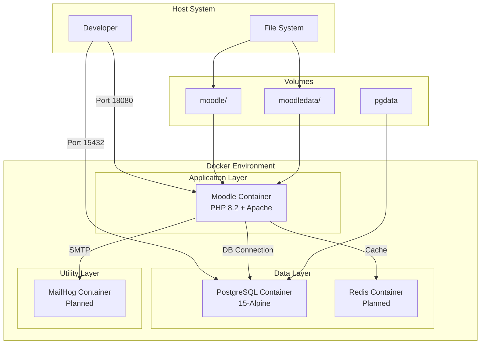
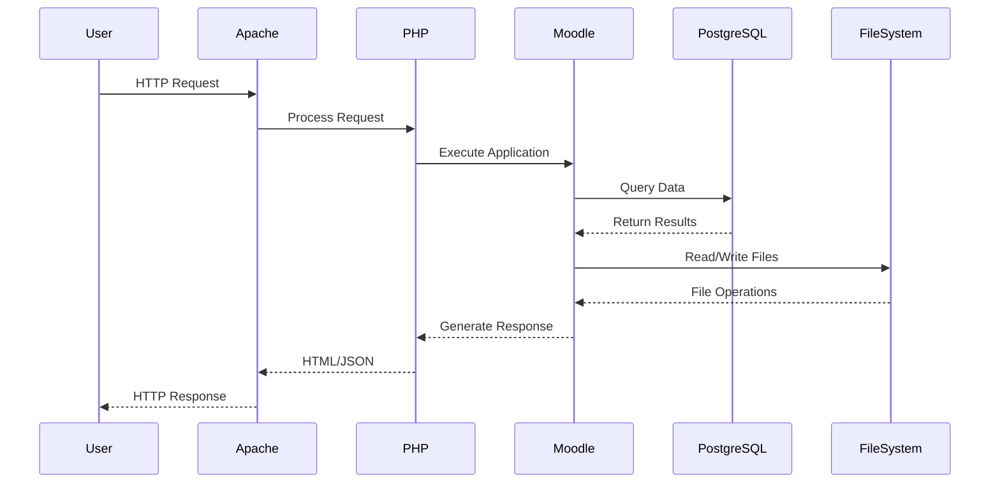
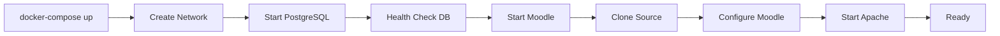
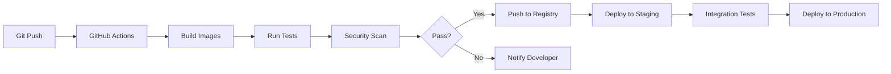

# System Architecture

## Architecture Overview

The Moodle Docker system implements a containerized microservices architecture designed for development efficiency and production scalability preparation.



## Container Architecture

### Service Topology

```yaml
Docker Network: moodle-network (bridge)
├── moodle-app (172.x.0.2)
│   ├── Apache Web Server
│   ├── PHP 8.2 Runtime
│   └── Moodle Application
│
├── moodle-db (172.x.0.3)
│   ├── PostgreSQL 15
│   └── Database Engine
│
├── moodle-redis (172.x.0.4) [Planned]
│   └── Redis Cache
│
└── moodle-mail (172.x.0.5) [Planned]
    ├── SMTP Server
    └── Web Interface
```

### Container Specifications

#### Moodle Application Container

**Base Image**: `php:8.2-apache`

**Layers**:
1. Base OS (Debian)
2. Apache Web Server
3. PHP Runtime
4. PHP Extensions
5. Moodle Source Code
6. Configuration Layer

**Resource Allocation**:
- CPU: 1.0 core (recommended)
- Memory: 512MB minimum, 1GB recommended
- Storage: 5GB for container + volumes

**Entry Point**: `/usr/local/bin/init-simple.sh`

#### PostgreSQL Database Container

**Base Image**: `postgres:15-alpine`

**Characteristics**:
- Lightweight Alpine Linux base
- Optimized for containers
- Built-in health checks
- Persistent volume storage

**Resource Allocation**:
- CPU: 0.5 core
- Memory: 256MB minimum
- Storage: 1GB initial, grows with data

## Network Architecture

### Network Design

```
┌─────────────────────────────────────┐
│          Host Network               │
│                                     │
│  ┌─────────────────────────────┐   │
│  │   Docker Bridge Network      │   │
│  │   (moodle-network)          │   │
│  │                             │   │
│  │  ┌──────────┐ ┌──────────┐ │   │
│  │  │ moodle   │ │ postgres │ │   │
│  │  │   :80    │ │  :5432   │ │   │
│  │  └──────────┘ └──────────┘ │   │
│  │         ↕           ↕       │   │
│  └─────────────────────────────┘   │
│            ↕           ↕           │
│        18080      15432           │
│            ↕           ↕           │
│      External Access Points        │
└─────────────────────────────────────┘
```

### Port Mapping Strategy

| Service | Container Port | Host Port | Protocol | Purpose |
|---------|---------------|-----------|----------|---------|
| Moodle | 80 | 18080 | TCP/HTTP | Web Interface |
| PostgreSQL | 5432 | 15432 | TCP | Database |
| Redis | 6379 | 16379 | TCP | Cache (Planned) |
| MailHog SMTP | 1025 | 11025 | TCP | Email Testing |
| MailHog UI | 8025 | 18025 | TCP/HTTP | Email Viewer |

### DNS Resolution

**Internal Resolution**:
- Service names resolve to container IPs
- `postgres` → moodle-db container
- `redis` → moodle-redis container

**External Resolution**:
- Host machine: `localhost:18080`
- Network: `<host-ip>:18080`

## Data Architecture

### Volume Management

```
Host File System
├── ./moodle/ (bind mount)
│   └── Moodle source code
│       ├── admin/
│       ├── lib/
│       ├── mod/
│       └── config.php
│
├── ./moodledata/ (bind mount)
│   └── Moodle data files
│       ├── cache/
│       ├── filedir/
│       ├── temp/
│       └── sessions/
│
└── Docker Volumes
    └── pgdata (named volume)
        └── PostgreSQL data
            ├── base/
            ├── global/
            └── pg_wal/
```

### Data Flow



### Database Schema

**Connection Parameters**:
```
Host: postgres (internal) / localhost:15432 (external)
Database: moodle
User: moodle
Password: <from .env>
Schema: public
```

**Key Tables** (Moodle Standard):
- `mdl_user` - User accounts
- `mdl_course` - Course definitions
- `mdl_modules` - Activity modules
- `mdl_config` - Configuration settings
- `mdl_files` - File metadata

## Security Architecture

### Container Security

```
┌────────────────────────────────┐
│     Security Layers            │
├────────────────────────────────┤
│ Network Isolation              │
│ ├── Bridge network             │
│ └── Internal DNS only          │
├────────────────────────────────┤
│ Process Isolation              │
│ ├── Container namespaces       │
│ └── Resource limits            │
├────────────────────────────────┤
│ File System Security           │
│ ├── Read-only layers          │
│ └── Volume permissions         │
├────────────────────────────────┤
│ Application Security           │
│ ├── Non-root processes        │
│ └── Minimal attack surface    │
└────────────────────────────────┘
```

### Development vs Production Security

| Aspect | Development | Production |
|--------|------------|------------|
| Passwords | Hardcoded in .env | External secrets |
| Ports | All exposed | Restricted access |
| SSL/TLS | Not configured | Required |
| Firewall | None | Configured |
| Monitoring | Basic logs | Full observability |
| Backups | Manual | Automated |

## Service Interactions

### Startup Sequence



### Runtime Dependencies

```yaml
Service Dependencies:
moodle:
  depends_on:
    postgres:
      condition: service_healthy

postgres:
  healthcheck:
    test: pg_isready
    interval: 10s
    retries: 5
```

### Communication Patterns

**Synchronous**:
- HTTP requests (User → Moodle)
- Database queries (Moodle → PostgreSQL)
- File operations (Moodle → Filesystem)

**Asynchronous** (Planned):
- Cache operations (Moodle → Redis)
- Email sending (Moodle → MailHog)
- Background jobs (Moodle cron)

## Scalability Architecture

### Current Limitations

- Single node deployment
- Vertical scaling only
- Shared file storage
- No load balancing
- Session in local files

### Production Evolution Path

```
Current (Dev):
┌─────────┐
│ Single  │
│ Moodle  │
│Instance │
└─────────┘

Phase 1 (Basic Prod):
┌─────────┐
│ Moodle  │──→ Redis Cache
│   +     │
│ Nginx   │──→ CDN
└─────────┘

Phase 2 (Scaled):
┌─────────┐
│  Load   │
│Balancer │
└────┬────┘
     │
┌────┼────┐
│    │    │
▼    ▼    ▼
M1   M2   M3
│    │    │
└────┼────┘
     ▼
  Shared
  Storage

Phase 3 (HA):
Kubernetes
Orchestration
```

## Performance Architecture

### Optimization Points

```
Request Flow Optimizations:
┌──────────┐
│ Client   │
└────┬─────┘
     │ 1. Static assets → CDN
     ▼
┌──────────┐
│  Nginx   │ 2. Reverse proxy
└────┬─────┘
     │ 3. PHP-FPM instead of mod_php
     ▼
┌──────────┐
│   PHP    │ 4. OpCache enabled
└────┬─────┘
     │ 5. Redis session/cache
     ▼
┌──────────┐
│  Redis   │ 6. Query cache
└────┬─────┘
     │ 7. Connection pooling
     ▼
┌──────────┐
│PostgreSQL│ 8. Optimized queries
└──────────┘
```

### Caching Strategy

**Level 1 - Browser Cache**:
- Static assets
- Cache headers

**Level 2 - CDN** (Production):
- Geographic distribution
- Edge caching

**Level 3 - Application Cache**:
- Redis for sessions
- Object caching
- Query results

**Level 4 - Database Cache**:
- Query plan cache
- Shared buffers

## Monitoring Architecture

### Metrics Collection

```yaml
Monitoring Stack (Planned):
├── Container Metrics
│   ├── CPU usage
│   ├── Memory usage
│   ├── Network I/O
│   └── Disk I/O
│
├── Application Metrics
│   ├── Request rate
│   ├── Response time
│   ├── Error rate
│   └── Active users
│
├── Database Metrics
│   ├── Query performance
│   ├── Connection pool
│   ├── Lock waits
│   └── Replication lag
│
└── Business Metrics
    ├── User logins
    ├── Course completions
    ├── File uploads
    └── System health
```

### Logging Architecture

```
Log Aggregation:
┌─────────────┐
│   Moodle    │──→ stdout/stderr
└─────────────┘         │
┌─────────────┐         │
│  PostgreSQL │──→ log file
└─────────────┘         │
┌─────────────┐         ▼
│   Apache    │──→ Docker Logs
└─────────────┘         │
                       ▼
                 Log Analysis
                 (ELK Stack)
```

## Disaster Recovery Architecture

### Backup Strategy

```
Backup Components:
┌────────────────────┐
│   Database         │
│  (pg_dump daily)   │
└────────────────────┘
┌────────────────────┐
│   Moodledata       │
│ (rsync hourly)     │
└────────────────────┘
┌────────────────────┐
│   Configuration    │
│ (git versioned)    │
└────────────────────┘
```

### Recovery Time Objectives

| Component | RPO | RTO | Method |
|-----------|-----|-----|--------|
| Database | 1 hour | 30 min | pg_restore |
| Files | 1 hour | 15 min | rsync restore |
| Config | 0 | 5 min | git checkout |
| Full System | 1 hour | 1 hour | Complete restore |

## Development Workflow Architecture

### CI/CD Pipeline (Future)



### Environment Promotion

```
Development → Staging → Production

Dev:
- Local Docker
- Latest code
- Debug enabled

Staging:
- Docker Swarm
- Release candidate
- Production-like

Production:
- Kubernetes
- Stable release
- Monitoring enabled
```

## Technology Integration Points

### Current Integrations

- **Git**: Source code management
- **Docker Hub**: Base images
- **GitHub**: Moodle source repository
- **PostgreSQL**: Primary database

### Planned Integrations

- **Redis**: Caching and sessions
- **MailHog**: Email testing
- **Prometheus**: Metrics collection
- **Grafana**: Metrics visualization
- **ELK Stack**: Log aggregation
- **MinIO**: Object storage
- **Nginx**: Reverse proxy
- **Let's Encrypt**: SSL certificates

## Architecture Decisions

### ADR-001: PostgreSQL over MySQL
**Decision**: Use PostgreSQL as primary database
**Rationale**: Better performance, native JSON support, advanced features
**Consequences**: Requires PostgreSQL expertise

### ADR-002: Alpine Linux for Database
**Decision**: Use Alpine-based PostgreSQL image
**Rationale**: Smaller size, security, performance
**Consequences**: Different package management

### ADR-003: Bind Mounts for Development
**Decision**: Use bind mounts for source code
**Rationale**: Live editing capability
**Consequences**: Platform-specific paths

### ADR-004: Custom Port Range
**Decision**: Use 10000+ port range
**Rationale**: Avoid conflicts with common services
**Consequences**: Non-standard ports require documentation

## Future Architecture Considerations

### Microservices Decomposition

Potential service separation:
- Authentication service
- File storage service
- Notification service
- Search service
- Analytics service

### Cloud-Native Evolution

Migration path:
1. Containerization (Complete)
2. Orchestration (Kubernetes)
3. Service mesh (Istio)
4. Serverless functions
5. Cloud-native databases

### Multi-Tenancy Support

Architecture for multiple instances:
- Shared database, separate schemas
- Container per tenant
- Dynamic routing
- Resource isolation
- Centralized management